<a id="readme-top"></a>

[![Contributors][contributors-shield]][contributors-url]
[![Forks][forks-shield]][forks-url]
[![Stargazers][stars-shield]][stars-url]
[![Issues][issues-shield]][issues-url]
[![MIT License][license-shield]][license-url]
[![LinkedIn][linkedin-shield]][linkedin-url]

<!-- PROJECT LOGO -->
<br />
<div align="center">
  <a href="https://github.com/tongducthanhnam/building_material_retail">
  
  </a>

<h3 align="center">
  Building Material Retail
</h3>
  <div >
  <p align="center"> 
    A Flutter project that helps you to manage your building material retail store.
  </p>    
    <br />
    <a href="https://github.com/tongducthanhnam/building_material_retail">
      <strong>Explore the docs »</strong>
    </a>
    <br />
    <br />
    <a href="https://github.com/tongducthanhnam/building_material_retail">View Demo</a>
    ·
    <a href="https://github.com/tongducthanhnam/building_material_retail/issues/new?labels=bug&template=bug-report---.md">Report Bug</a>
    ·
    <a href="https://github.com/tongducthanhnam/building_material_retail/issues/new?labels=enhancement&template=feature-request---.md">
      Request Feature</a>
    </div>
</div>

<!-- TABLE OF CONTENTS -->
<details>
  <summary>Table of Contents</summary>
  <ol>
    <li>
      <a href="#about-the-project">About The Project</a>
      <ul>
        <li><a href="#built-with">Built With</a></li>
      </ul>
    </li>
    <li>
      <a href="#getting-started">Getting Started</a>
      <ul>
        <li><a href="#prerequisites">Prerequisites</a></li>
        <li><a href="#installation">Installation</a></li>
      </ul>
    </li>
    <li><a href="#usage">Usage</a></li>
    <li><a href="#roadmap">Roadmap</a></li>
    <li><a href="#contributing">Contributing</a></li>
    <li><a href="#license">License</a></li>
    <li><a href="#contact">Contact</a></li>
    <li><a href="#acknowledgments">Acknowledgments</a></li>
  </ol>
</details>

## About The Project

[//]: # (Here's a blank template to get started: To avoid retyping too much info. Do a search and replace with your text editor for the following: `github_username`, `repo_name`, `twitter_handle`, `linkedin_username`, `email_client`, `email`, `project_title`, `project_description`)

## Screenshots

<p align="center">
  
  
  
  
</p>

<div align="right">(<a href="#readme-top">back to top</a>)
</div>

### Built With

[![Flutter][Flutter]][Flutter-url]

<div align="right">
  (<a href="#readme-top">back to top</a>)
</div>

<!-- GETTING STARTED -->

## Getting Started

This is an example of how you may give instructions on setting up your project locally.
To get a local copy up and running follow these simple example steps.

### Schema:

```mermaid
erDiagram
    store ||--o{ staff : "has"
    store ||--o{ customer : "has"
    store ||--o{ product : "has"
    store ||--o{ inventory : "has"
    store ||--o{ sales_order : "has"
    store ||--o{ quotation : "has"
    
    product ||--o{ product_variant : "has"
    product_variant ||--o{ inventory : "tracked_in"
    product_variant ||--o{ order_detail : "ordered_in"
    product_variant ||--o{ quotation_detail : "quoted_in"
    
    inventory ||--o{ inventory_batch : "contains"
    inventory ||--o{ inventory_movement : "has_movement"
    inventory ||--o{ stock_alert : "has_alert"
    inventory ||--o{ reorder_suggestion : "has_suggestion"
    
    inventory_batch ||--o{ inventory_movement : "tracked_in"
    
    staff ||--o{ inventory : "updates"
    staff ||--o{ inventory_movement : "creates"
    staff ||--o{ stock_alert : "resolves"
    staff ||--o{ reorder_suggestion : "approves"
    staff ||--o{ sales_order : "handles"
    staff ||--o{ quotation : "creates"
    
    customer ||--o{ sales_order : "places"
    customer ||--o{ quotation : "receives"
    
    sales_order ||--o{ order_detail : "contains"
    quotation ||--o{ quotation_detail : "contains"

    store {
        UUID id PK "Mã cửa hàng"
        VARCHAR(255) name "Tên cửa hàng"
        TEXT address "Địa chỉ"
        VARCHAR(20) phone "Số điện thoại"
        VARCHAR(100) email "Email"
        VARCHAR(50) bank_number "Số tài khoản"
        VARCHAR(100) bank_name "Tên ngân hàng"
        VARCHAR(100) bank_branch "Chi nhánh"
        VARCHAR(100) bank_account_holder "Chủ tài khoản"
        VARCHAR(20) tax_number "Mã số thuế"
        TIMESTAMPTZ created_at "Ngày tạo"
        TIMESTAMPTZ updated_at "Ngày cập nhật"
    }
    
    staff {
        UUID id PK "ID từ auth.users"
        UUID store_id FK "Chi nhánh"
        VARCHAR(255) full_name "Tên đầy đủ"
        VARCHAR(50) role "Vai trò"
        TIMESTAMPTZ created_at "Ngày tạo"
        TIMESTAMPTZ updated_at "Ngày cập nhật"
    }
    
    customer {
        UUID id PK "Mã KH"
        UUID store_id FK "Chi nhánh"
        VARCHAR(255) name "Tên KH"
        VARCHAR(20) phone "SĐT"
        VARCHAR(100) email "Email"
        TEXT address "Địa chỉ"
        VARCHAR(50) tax_code "Mã số thuế"
        VARCHAR(50) customer_type "Loại KH"
        TIMESTAMPTZ created_at "Ngày tạo"
        TIMESTAMPTZ updated_at "Ngày cập nhật"
    }
    
    product {
        UUID id PK "Mã SP"
        UUID store_id FK "Chi nhánh"
        VARCHAR(100) name "Tên SP"
        TEXT description "Mô tả"
        DECIMAL min_price "Giá tối thiểu"
        DECIMAL max_price "Giá tối đa"
        INTEGER variant_count "Số biến thể"
        TEXT image_url "Ảnh"
        VARCHAR(30) unit "Đơn vị tính"
        VARCHAR(50) category "Nhóm hàng"
        NUMERIC tax_rate "Thuế suất"
        TEXT status "Trạng thái"
        TIMESTAMPTZ created_at
        TIMESTAMPTZ updated_at
    }
    
    product_variant {
        UUID id PK "Mã biến thể"
        UUID product_id FK "Sản phẩm cha"
        VARCHAR(50) sku "SKU"
        NUMERIC base_price "Giá gốc"
        NUMERIC sale_price "Giá bán"
        JSONB technical_specs "Thuộc tính kỹ thuật"
        TIMESTAMPTZ created_at
        TIMESTAMPTZ updated_at
    }
    
    inventory {
        UUID id PK
        UUID product_variant_id FK "Biến thể"
        UUID store_id FK "Chi nhánh"
        UUID last_updated_by FK "Người cập nhật"
        INTEGER quantity "Số lượng tồn"
        INTEGER reserved_quantity "Đã đặt hàng"
        INTEGER available_quantity "Có thể bán"
        INTEGER minimum_stock_level "Mức tối thiểu"
        INTEGER reorder_point "Điểm đặt hàng"
        INTEGER reorder_quantity "SL đặt lại"
        NUMERIC unit_cost "Giá nhập"
        NUMERIC total_cost "Tổng giá trị"
        VARCHAR(50) location_code "Vị trí kho"
        TIMESTAMPTZ last_counted_at "Ngày kiểm kê"
        TIMESTAMPTZ created_at
        TIMESTAMPTZ updated_at
    }
    
    inventory_batch {
        UUID id PK
        UUID inventory_id FK "Tồn kho"
        VARCHAR(100) batch_number "Số lô"
        VARCHAR(100) lot_number "Số lot"
        INTEGER quantity "Số lượng"
        NUMERIC unit_cost "Giá nhập"
        DATE manufactured_date "Ngày SX"
        DATE expiration_date "Hạn dùng"
        DATE best_before_date "Nên dùng trước"
        VARCHAR(200) supplier_name "Nhà CC"
        VARCHAR(100) supplier_batch_ref "Mã lô NCC"
        VARCHAR(20) quality_status "Trạng thái CL"
        TEXT quality_notes "Ghi chú CL"
        VARCHAR(20) status "Trạng thái"
        TIMESTAMPTZ created_at
        TIMESTAMPTZ updated_at
    }
    
    inventory_movement {
        UUID id PK
        UUID inventory_id FK "Tồn kho"
        UUID batch_id FK "Lô"
        UUID created_by FK "Người tạo"
        UUID approved_by FK "Người duyệt"
        VARCHAR(20) movement_type "Loại dịch chuyển"
        INTEGER quantity "Số lượng"
        NUMERIC unit_cost "Giá nhập/xuất"
        VARCHAR(20) reference_type "Loại chứng từ"
        UUID reference_id "ID chứng từ"
        VARCHAR(200) reason "Lý do"
        TEXT notes "Ghi chú"
        TIMESTAMPTZ created_at
    }
    
    sales_order {
        UUID id PK
        UUID store_id FK "Chi nhánh"
        UUID customer_id FK "Khách hàng"
        UUID staff_id FK "Nhân viên"
        VARCHAR(50) order_code "Mã đơn"
        VARCHAR(30) status "Trạng thái"
        DECIMAL sub_total "Tiền hàng"
        DECIMAL tax_amount "Thuế"
        DECIMAL discount_amount "Chiết khấu"
        DECIMAL shipping_fee "Phí ship"
        DECIMAL total_amount "Tổng tiền"
        VARCHAR(50) shipping_method "PT vận chuyển"
        VARCHAR(100) shipping_partner "Đối tác VC"
        TEXT shipping_address "Địa chỉ giao"
        TEXT notes "Ghi chú"
        VARCHAR(50) payment_method "PT thanh toán"
        VARCHAR(30) payment_status "Trạng thái TT"
        TIMESTAMPTZ created_at
        TIMESTAMPTZ updated_at
    }
    
    order_detail {
        UUID id PK
        UUID order_id FK "Đơn hàng"
        UUID product_variant_id FK "Biến thể"
        INTEGER quantity "Số lượng"
        NUMERIC unit_price "Đơn giá"
    }
    
    quotation {
        UUID id PK
        UUID store_id FK "Chi nhánh"
        UUID customer_id FK "Khách hàng"
        UUID staff_id FK "Nhân viên"
        UUID created_by FK "Người tạo"
        UUID updated_by FK "Người cập nhật"
        VARCHAR(50) quotation_code "Mã báo giá"
        VARCHAR(30) status "Trạng thái"
        DATE valid_from "Ngày hiệu lực"
        DATE valid_until "Ngày hết hạn"
        DECIMAL sub_total "Tiền hàng"
        DECIMAL discount_amount "Chiết khấu"
        DECIMAL tax_amount "Thuế"
        DECIMAL total_amount "Tổng tiền"
        VARCHAR(10) currency_code "Loại tiền"
        NUMERIC vat_percent "% VAT"
        TEXT notes "Ghi chú"
        TIMESTAMPTZ created_at
        TIMESTAMPTZ updated_at
    }
    
    quotation_detail {
        UUID id PK
        UUID quotation_id FK "Báo giá"
        UUID product_variant_id FK "Biến thể"
        INTEGER quantity "Số lượng"
        NUMERIC unit_price "Đơn giá"
    }
```


### Libraries Used

- Riverpod
- Supabase
- Flutter
- Image Picker
- photo_manager
- image_cropper

### Built With

* [Flutter](https://flutter.dev/) - The web framework used

### Prerequisites

Before you begin, ensure you have met the following requirements:

- Flutter SDK installed
- IDE like Android Studio or VS Code
- Virtual or Read Device

### Installation

- Clone the repository:

```
git clone https://github.com/tongducthanhnam/building_material_retail
```

- Flutter pub get

```
flutter pub get
```

- Image_crop: Go to AndroidManifest.xml and add the following permissions

```xml
<activity android:name="com.yalantis.ucrop.UCropActivity" android:screenOrientation="portrait"
    android:theme="@style/Theme.AppCompat.Light.NoActionBar" />
```

- Flutter run

```
flutter run
```

<p align="right">(<a href="#readme-top">back to top</a>)</p>

<!-- USAGE EXAMPLES -->

## Usage

[//]: # (Use this space to show useful examples of how a project can be used. Additional screenshots, code examples and demos work well in this space. You may also link to more resources.)

_For more examples, please refer to
the [Documentation](https://github.com/tongducthanhnam/building_material_retail?tab=readme-ov-file)_

<p align="right">(<a href="#readme-top">back to top</a>)</p>

<!-- ROADMAP -->

## Roadmap

- [x] Create new Product
- [x] Edit Product
- [x] Cart feature
- [ ] Order feature
- [ ] User Authentication
- [ ] User Profile
- [ ] User Management
- [ ] Analytics & Statistics feature
- [ ] Report feature

See the [open issues](https://github.com/tongducthanhnam/building_material_retail/issues) for a full
list of
proposed features (and known issues).

<p align="right">(<a href="#readme-top">back to top</a>)</p>

<!-- CONTRIBUTING -->

## Contributing

Contributions are what make the open source community such an amazing place to learn, inspire, and
create. Any contributions you make are **greatly appreciated**.

If you have a suggestion that would make this better, please fork the repo and create a pull
request. You can also simply open an issue with the tag "enhancement".
Don't forget to give the project a star! Thanks again!

1. Fork the Project
2. Create your Feature Branch (`git checkout -b feature/AmazingFeature`)
3. Commit your Changes (`git commit -m 'Add some AmazingFeature'`)
4. Push to the Branch (`git push origin feature/AmazingFeature`)
5. Open a Pull Request

<p align="right">(<a href="#readme-top">back to top</a>)</p>

### Top contributors:

<a href="https://github.com/tongducthanhnam/building_material_retail/graphs/contributors">
  
</a>

<!-- LICENSE -->

## License

Distributed under the MIT License. See `LICENSE` for more information.

<p align="right">(<a href="#readme-top">back to top</a>)</p>

<!-- CONTACT -->

## Contact

[@tongducthanhnam](https://twitter.com/tongducthanhnam) - tongducthanhnam@gmail.com

[My Portfolio](https://tongducthanhnam.id.vn)

<p align="right">(<a href="#readme-top">back to top</a>)</p>

<!-- What I have learn -->

## What I have learned

- Stateful Widget: setState(), initState(), build(), dispose()
- Using Column, Row,
- Using Map, List, For loop

<!-- ACKNOWLEDGMENTS -->

## Acknowledgments

* [Flutter & Dart - The Complete Guide [2024 Edition]](https://www.udemy.com/course/learn-flutter-dart-to-build-ios-android-apps)

<p align="right">(<a href="#readme-top">
  back to top
</a>)</p>

<!-- MARKDOWN LINKS & IMAGES -->
<!-- https://www.markdownguide.org/basic-syntax/#reference-style-links -->

[contributors-shield]: https://img.shields.io/github/contributors/tongducthanhnam/building_material_retail.svg?style=for-the-badge
[contributors-url]: https://github.com/tongducthanhnam/building_material_retail/graphs/contributors
[forks-shield]: https://img.shields.io/github/forks/tongducthanhnam/building_material_retail.svg?style=for-the-badge
[forks-url]: https://github.com/tongducthanhnam/building_material_retail/network/members
[stars-shield]: https://img.shields.io/github/stars/tongducthanhnam/building_material_retail.svg?style=for-the-badge
[stars-url]: https://github.com/tongducthanhnam/building_material_retail/stargazers
[issues-shield]: https://img.shields.io/github/issues/tongducthanhnam/building_material_retail.svg?style=for-the-badge
[issues-url]: https://github.com/tongducthanhnam/building_material_retail/issues
[license-shield]: https://img.shields.io/github/license/tongducthanhnam/building_material_retail.svg?style=for-the-badge
[license-url]: https://github.com/tongducthanhnam/building_material_retail/blob/master/LICENSE
[linkedin-shield]: https://img.shields.io/badge/-LinkedIn-black.svg?style=for-the-badge&logo=linkedin&colorB=555
[linkedin-url]: https://linkedin.com/in/tong-duc-thanh-nam
[//]: # ([product-screenshot]: images/screenshot.png)
[Flutter]:https://img.shields.io/badge/Flutter-%2302569B.svg?style=for-the-badge&logo=Flutter&logoColor=white
[Flutter-url]:https://flutter.dev